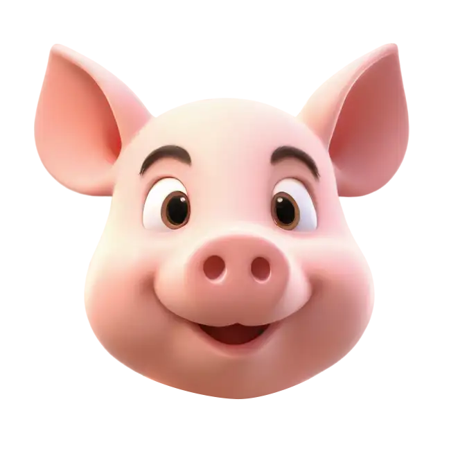
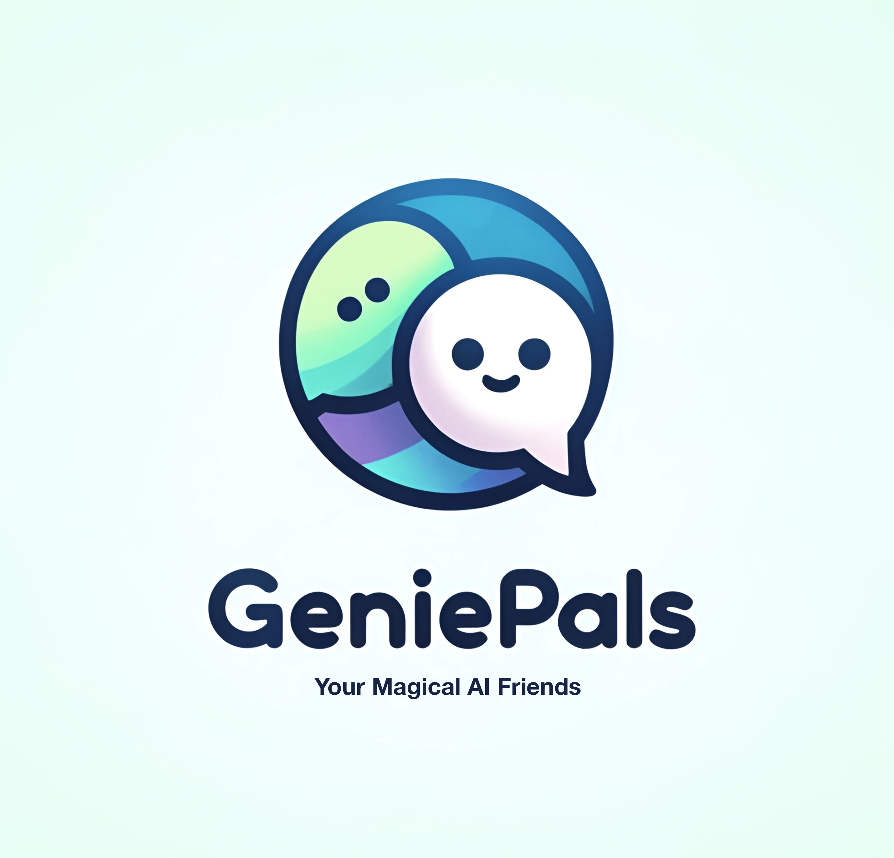

 

   
   <h3 align="center">GeniePals</h3>
   

      Chat, Play, Learn: Your Magical AI Friends!
       
       
      <a href="https://devpost.com/software/geniepals"><strong>Link to project »</strong></a>
       
       
      <a href="#">View Demo .</a>  
      <a href="https://github.com/ziyi-zhu/geniepals/issues/new?labels=bug&amp;template=bug_report.md">Report Bug .</a>
      <a href="https://github.com/ziyi-zhu/geniepals/issues/new?labels=enhancement&amp;&template=feature_request.md">Request Feature</a>
   

  

## Table of Contents

- [About The Project](#about-the-project)
- [Getting Started](#getting-started)
   - [Assets](#assets)
   - [Localization](#localization)
- [License](#license)
- [Contact](#contact)
- [Acknowledgments](#acknowledgments)

## About The Project

### Built With

This project was built with the following technologies:

- [Flutter](https://flutter.dev/)
- [Rive](https://rive.app/)
- [ElevenLabs](https://elevenlabs.io/)
- [Google AI Studio](https://makersuite.google.com/)

## Getting Started

This project is a Flutter application that follows the [simple app state management tutorial](https://flutter.dev/docs/development/data-and-backend/state-mgmt/simple).

For help getting started with Flutter development, view the [online documentation](https://flutter.dev/docs), which offers tutorials, samples, guidance on mobile development, and a full API reference.

### Assets

The `assets` directory houses images, fonts, and any other files you want to include with your application.

The `assets/images` directory contains [resolution-aware images](https://flutter.dev/docs/development/ui/assets-and-images#resolution-aware).

### Localization

This project generates localized messages based on arb files found in the `lib/src/localization` directory.

To support additional languages, please visit the tutorial on [Internationalizing Flutter apps](https://flutter.dev/docs/development/accessibility-and-localization/internationalization)

## License

This work is licensed under a [Creative Commons Attribution-NoDerivs 4.0 International License](https://creativecommons.org/licenses/by-nd/4.0/).

## Contact

If you have any questions or suggestions, feel free to reach out to me:

- Raise an issue on the repository: [GitHub Repository](https://github.com/ziyi-zhu/geniepals)
- Connect with me on LinkedIn: [@ziyizhu](https://www.linkedin.com/in/ziyizhu/)

## Acknowledgments

A special thanks to the following for their contributions, support and inspiration:

- [makeread.me](https://github.com/ShaanCoding/makeread.me)
- [@JcToon](https://rive.app/@JcToon/)
- [@techieblossom](https://www.youtube.com/@techieblossom)