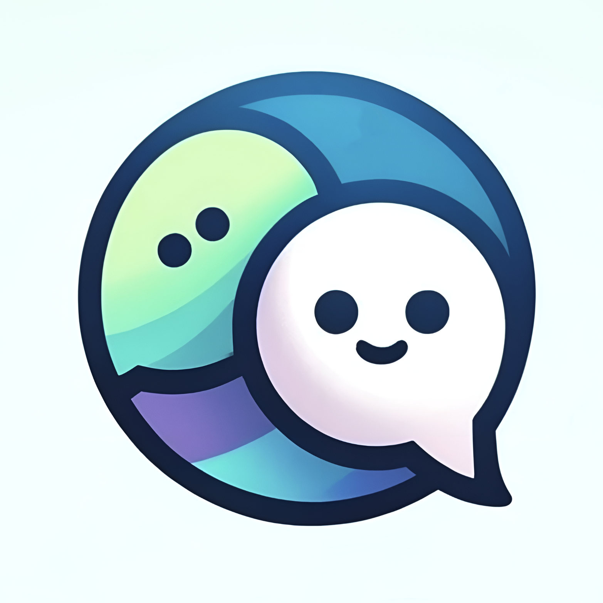

 

   
   <h3 align="center">GeniePals</h3>
   

      Chat, Play, Learn: Your Magical AI Friends!
       
       
      <a href="https://devpost.com/software/geniepals"><strong>Link to project »</strong></a>
       
       
      <a href="https://youtu.be/4hfYCKZSbts">View Demo .</a>  
      <a href="https://github.com/ziyi-zhu/geniepals/issues/new?labels=bug&amp;template=bug_report.md">Report Bug .</a>
      <a href="https://github.com/ziyi-zhu/geniepals/issues/new?labels=enhancement&amp;&template=feature_request.md">Request Feature</a>
   

  

## Table of Contents

- [About The Project](#about-the-project)
   - [Inspiration](#inspiration)
   - [Learning Experience](#learning-experience)
   - [Challenges Faced](#challenges-faced)
   - [Conclusion](#conclusion)
   - [Built With](#built-with)
- [Getting Started](#getting-started)
   - [Assets](#assets)
   - [Localization](#localization)
- [License](#license)
- [Contact](#contact)
- [Acknowledgments](#acknowledgments)

## About The Project

### Inspiration
The catalyst for creating GeniePals was the remarkable exponential growth in Large Language Models (LLMs) and their capabilities. I noticed that despite the technological advances, there was a significant gap in interfaces that could seamlessly integrate human interaction with these powerful LLMs, particularly for children. Children's engagement with technology often lacks a purposeful and beneficial interaction. This observation sparked the idea to build an app that not only entertains but also educates and provides emotional support to kids. By chatting, learning, and playing with their AI friends, children can form meaningful companionships that contribute positively to their social and intellectual development.

### Learning Experience
Throughout the development of GeniePals, I delved deep into the intricacies of user experience, particularly focusing on how children interact with technology. The key learnings were around designing intuitive user interfaces that cater to the young mind, which is curious but easily distracted. This project taught me the importance of merging technical prowess with creative design to craft experiences that are both educational and engaging.

### Building GeniePals
GeniePals was built using Flutter, a versatile framework that allowed for rapid development and smooth, native performance across both Android and iOS platforms. For animations, I utilized Rive, which enabled me to create and control detailed animations that respond to user interactions—vital for keeping the interactions lively and engaging.

The AI backbone of GeniePals is powered by Gemini, a robust LLM that offers a wide range of conversational capabilities suited for educational purposes. On-device speech recognition was implemented to ensure privacy and responsiveness, giving kids the ability to interact with their AI friends via voice. The spoken output of the AI is generated through the ElevenLabs API, which provides highly realistic voice synthesis, making the AI companions sound friendly and approachable.

### Challenges Faced
One of the primary challenges was ensuring that the interaction between children and the AI was safe and appropriate. While Google Gemini has built-in safety settings, achieving optimal performance—balancing safety with fun and engagement—required fine-tuning. Implementing filters and safeguards to prevent any harmful content while maintaining a conversational flow was a complex task that necessitated thorough testing and iteration.

Another significant challenge was designing AI responses to be empathetic and supportive, mirroring human-like emotions through text, speech, and animation. To reliably process model outputs and properly display text and emotions with the correct content, I chose to guide Gemini to generate structured responses in JSON. Integrating these elements to work synchronously while keeping app performance optimal involved more testing and iteration, ensuring that all components functioned harmoniously.

### Conclusion
The journey of creating GeniePals has been immensely fulfilling. From conceptualization to execution, each phase of the project brought its own set of challenges and learnings. The final product not only bridges the gap between human interaction and LLMs for children but also enriches their daily lives by offering a magical AI friend who can chat, play, and learn with them. Watching the children of my colleagues interact with GeniePals and hearing their laughter and excitement has been the greatest reward, affirming the impact of combining technology with compassion and creativity.

### Built With

This project was built with the following technologies:

- [Flutter](https://flutter.dev/)
- [Rive](https://rive.app/)
- [ElevenLabs](https://elevenlabs.io/)
- [Google AI Studio](https://makersuite.google.com/)

## Getting Started

This project is a Flutter application that follows the [simple app state management tutorial](https://flutter.dev/docs/development/data-and-backend/state-mgmt/simple).

For help getting started with Flutter development, view the [online documentation](https://flutter.dev/docs), which offers tutorials, samples, guidance on mobile development, and a full API reference.

### Assets

The `assets` directory houses images, fonts, and any other files you want to include with your application.

The `assets/images` directory contains [resolution-aware images](https://flutter.dev/docs/development/ui/assets-and-images#resolution-aware).

### Localization

This project generates localized messages based on arb files found in the `lib/src/localization` directory.

To support additional languages, please visit the tutorial on [Internationalizing Flutter apps](https://flutter.dev/docs/development/accessibility-and-localization/internationalization)

## License

This work is licensed under a [Creative Commons Attribution-NonCommercial 4.0 International License](https://creativecommons.org/licenses/by-nc/4.0/).

## Contact

If you have any questions or suggestions, feel free to reach out to me:

- Raise an issue on the repository: [GitHub Repository](https://github.com/ziyi-zhu/geniepals)
- Connect with me on LinkedIn: [@ziyizhu](https://www.linkedin.com/in/ziyizhu/)

## Acknowledgments

A special thanks to the following for their contributions, support and inspiration:

- [makeread.me](https://github.com/ShaanCoding/makeread.me)
- [@JcToon](https://rive.app/@JcToon/)
- [@techieblossom](https://www.youtube.com/@techieblossom)